

<!-- setup 3col/9col grid for toc_float and main content  -->

<h1 class="title toc-ignore">CDB Incidence Rate Investigation</h1>

<h1>Data</h1>

For convenience, only one year of exposure records was used: 2010. So the dataset is the concatenation of the 2010 exposure records with the 2005-2013 claims records. The year 2010 was not chosen for any particular reason.

Data was gathered from the source files using Python. All sheets in “EPallExp2016CDBStudy_2010.xlsb” were concatenated then saved as “exposure.csv”; the data in “20171105 CDB CLAIMS- sponsors db.xlsb” was saved as “claims.csv”.

<h1>Preamble</h1>

Packages, settings, and data import are in the code below.

<pre class="r"><code>### PREAMBLE ---------------------------------------------------
### General
library(magrittr)       # extend R syntax with %&gt;% notation
library(tidyverse)      # data manipulation
library(stringr)        # string manipulation
library(skimr)          # data summaries
library(knitr)          # rendering R objects into Markdown

### Plotting
library(ggcorrplot)     # correlation plots for ggplot2
library(gridExtra)      # arranging multiple plots for ggplot2

### Statistics
library(caret)          # partition data
library(sandwich)       # gets heteroskedastic standard errors from regression
library(logistf)        # penalized logistic regressions
library(glmnet)         # ridge regression
library(pracma)         # for matrix algebra 

### Settings
options(scipen = 999)   # removes scientific notation for small numbers

### Import data
# Data was compiled from source in Python.
exposure &lt;-
  read.csv(&quot;~/CDB/exposure.csv&quot;,
           na.strings = c(&quot;&quot;),
           stringsAsFactors = T)
claims &lt;-
  read.csv(&quot;~/CDB/claims.csv&quot;,
           na.strings = c(&quot;&quot;),
           stringsAsFactors = T)

# Create Y variable and concatenate
exposure$claim &lt;- 0
claims$claim &lt;- 1
data.initial &lt;- rbind(exposure, claims)</code></pre>

<h1>Data Summary</h1>

<h3>Set-up</h3>

Code for setting up summary functions is below.

<pre class="r"><code>### Create summary of dataset
mySummary &lt;- function(data, y) {
  require(magrittr)
  n &lt;- dim(data)[1]
  v &lt;- dim(data)[2]
  c &lt;- sum(y)
  e &lt;- n - c
  labels &lt;- c(&quot;Number of Observations&quot;,
              &quot;Number of Variables&quot;,
              &quot;Claims&quot;,
              &quot;Exposure&quot;)
  output &lt;- data.frame(labels, c(n, v, c, e))
  colnames(output) &lt;- c(&quot;Summary&quot;, &quot;Values&quot;)
  return(output)
}
kableIncidence &lt;- function(summary){
  tibble(Incidence = summary[3,2] / summary[1,2]) %&gt;% kable(digits = 4, align=&quot;l&quot;)
}
data.initial.summary &lt;- mySummary(data.initial, data.initial$claim)

### Create summary of variables using package skimr
# Define summary statistics (skimmers)
base.skimmers &lt;- sfl(missing_values = n_missing)

skimList &lt;- function(x) {
  levels &lt;- levels(x)
  paste0(levels, collapse = &quot;, &quot;)
}

factor.skimmers &lt;- sfl(
  n_unique = &quot;n_unique&quot;,
  categories = skimList,
  ordered = NULL,
  top_counts = NULL
)

numeric.skimmers &lt;- sfl(hist = NULL)

# Compile the skimming function
mySkim &lt;- skim_with(numeric = numeric.skimmers,
                    base = base.skimmers,
                    factor = factor.skimmers)

# Need industry to be numeric for later processing
# For summary purposes replace it with a factor
data.initial.industryfactor &lt;-
  mutate(data.initial, NAISC = as.factor(NAISC))
data.initial.skim &lt;- mySkim(data.initial.industryfactor)</code></pre>

<h3>Summary</h3>
<pre class="r"><code># Overall summary
kable(data.initial.summary,
      digits = 0,
      format.args = list(big.mark = &quot;,&quot;))</code></pre>
<table>
<thead>
<tr class="header">
<th align="left">Summary</th>
<th align="right">Values</th>
</tr>
</thead>
<tbody>
<tr class="odd">
<td align="left">Number of Observations</td>
<td align="right">1,218,936</td>
</tr>
<tr class="even">
<td align="left">Number of Variables</td>
<td align="right">6</td>
</tr>
<tr class="odd">
<td align="left">Claims</td>
<td align="right">94,396</td>
</tr>
<tr class="even">
<td align="left">Exposure</td>
<td align="right">1,124,540</td>
</tr>
</tbody>
</table>
<pre class="r"><code>kableIncidence(data.initial.summary)</code></pre>
<table>
<thead>
<tr class="header">
<th align="left">Incidence</th>
</tr>
</thead>
<tbody>
<tr class="odd">
<td align="left">0.0774</td>
</tr>
</tbody>
</table>

<h4>Factor Variables</h4>
<pre class="r"><code># Factor variables summary
data.initial.skim.factor &lt;- yank(data.initial.skim, &quot;factor&quot;)
colnames(data.initial.skim.factor) &lt;- data.initial.skim.factor %&gt;%
  colnames() %&gt;%
  str_replace(&quot;_&quot;, &quot; &quot;) %&gt;%
  str_to_title()
kable(data.initial.skim.factor)</code></pre>
<table>
<colgroup>
<col width="9%" />
<col width="10%" />
<col width="6%" />
<col width="73%" />
</colgroup>
<thead>
<tr class="header">
<th align="left">Skim Variable</th>
<th align="right">Missing Values</th>
<th align="right">N Unique</th>
<th align="left">Categories</th>
</tr>
</thead>
<tbody>
<tr class="odd">
<td align="left">NAISC</td>
<td align="right">46</td>
<td align="right">26</td>
<td align="left">11, 21, 22, 23, 31, 33, 41, 44, 48, 51, 52, 53, 54, 55, 56, 61, 62, 63, 71, 72, 81, 91, 96, 97, 98, 99</td>
</tr>
<tr class="even">
<td align="left">Province</td>
<td align="right">46</td>
<td align="right">15</td>
<td align="left">AB, BC, MB, NB, NL, NS, NT, NU, ON, PE, QC, RC, SK, YK, XX</td>
</tr>
<tr class="odd">
<td align="left">Gender</td>
<td align="right">46</td>
<td align="right">2</td>
<td align="left">F, M</td>
</tr>
</tbody>
</table>

<h4>Numeric Variables</h4>
<pre class="r"><code># Numeric variables summary
data.initial.skim.numeric &lt;- yank(data.initial.skim, &quot;numeric&quot;)
colnames(data.initial.skim.numeric) &lt;- data.initial.skim.numeric %&gt;%
  colnames() %&gt;%
  str_replace(&quot;_&quot;, &quot; &quot;) %&gt;%
  str_to_title()
colnames(data.initial.skim.numeric)[5:9] &lt;-
  c(&quot;Min&quot;, &quot;1st Qu.&quot;, &quot;Median&quot;, &quot;3rd Qu.&quot;, &quot;Max&quot;)
kable(data.initial.skim.numeric, digits = 2)</code></pre>
<table>
<thead>
<tr class="header">
<th align="left">Skim Variable</th>
<th align="right">Missing Values</th>
<th align="right">Mean</th>
<th align="right">Sd</th>
<th align="right">Min</th>
<th align="right">1st Qu.</th>
<th align="right">Median</th>
<th align="right">3rd Qu.</th>
<th align="right">Max</th>
</tr>
</thead>
<tbody>
<tr class="odd">
<td align="left">Benefit</td>
<td align="right">46</td>
<td align="right">2509.48</td>
<td align="right">1203.82</td>
<td align="right">0</td>
<td align="right">1740</td>
<td align="right">2229</td>
<td align="right">3000</td>
<td align="right">20000</td>
</tr>
<tr class="even">
<td align="left">Age</td>
<td align="right">46</td>
<td align="right">42.43</td>
<td align="right">11.23</td>
<td align="right">0</td>
<td align="right">33</td>
<td align="right">43</td>
<td align="right">51</td>
<td align="right">111</td>
</tr>
<tr class="odd">
<td align="left">claim</td>
<td align="right">0</td>
<td align="right">0.08</td>
<td align="right">0.27</td>
<td align="right">0</td>
<td align="right">0</td>
<td align="right">0</td>
<td align="right">0</td>
<td align="right">1</td>
</tr>
</tbody>
</table>

<h1>Data Cleaning</h1>

<h3>Missing Values</h3>

There 46 rows with missing values (not including industry codes 96 to 99), which are all from the exposure dataset (Y=0). Drop these values, as the effect is negligible. First few rows shown below.

<pre class="r"><code># Retrieve rows with missing values
data.na &lt;- subset(data.initial, rowSums(is.na(data.initial)) &gt; 0)
kable(data.na[-1] %&gt;% head %&gt;% as_tibble(), 
      col.names = c(&quot;Province&quot;,&quot;Gender&quot;,&quot;Benefit&quot;,&quot;Age&quot;,&quot;Claim&quot;),
      align = &quot;l&quot;)</code></pre>
<table>
<thead>
<tr class="header">
<th align="left">Province</th>
<th align="left">Gender</th>
<th align="left">Benefit</th>
<th align="left">Age</th>
<th align="left">Claim</th>
</tr>
</thead>
<tbody>
<tr class="odd">
<td align="left">NA</td>
<td align="left">NA</td>
<td align="left">NA</td>
<td align="left">NA</td>
<td align="left">0</td>
</tr>
<tr class="even">
<td align="left">NA</td>
<td align="left">NA</td>
<td align="left">NA</td>
<td align="left">NA</td>
<td align="left">0</td>
</tr>
<tr class="odd">
<td align="left">NA</td>
<td align="left">NA</td>
<td align="left">NA</td>
<td align="left">NA</td>
<td align="left">0</td>
</tr>
<tr class="even">
<td align="left">NA</td>
<td align="left">NA</td>
<td align="left">NA</td>
<td align="left">NA</td>
<td align="left">0</td>
</tr>
<tr class="odd">
<td align="left">NA</td>
<td align="left">NA</td>
<td align="left">NA</td>
<td align="left">NA</td>
<td align="left">0</td>
</tr>
<tr class="even">
<td align="left">NA</td>
<td align="left">NA</td>
<td align="left">NA</td>
<td align="left">NA</td>
<td align="left">0</td>
</tr>
</tbody>
</table>
<pre class="r"><code># Remove these 46 rows. Small amount and all have Y=0
data &lt;- subset(data.initial, rowSums(is.na(data.initial)) == 0)</code></pre>

<h3>Age</h3>

Looking at the tail ends of the age distribution, there are unexpected data at the minimum and maximum: age = 0 and age = 111. To simplify the problem, these rows will be removed along rows for very low and very high ages: under 16 and over 64. 18 exposure and 2 claim rows were removed for ages under 16, and 2186 exposure and 287 claim rows were removed for ages over 64.

<strong>Lower tail</strong>

<pre class="r"><code># Before starting, rename variables for convenience
colnames(data) &lt;- str_to_lower(colnames(data)) %&gt;%
  str_replace(&quot;province&quot;, &quot;prov&quot;) %&gt;%
  str_replace(&quot;benefit&quot;, &quot;ben&quot;)

age.freq &lt;- with(data, table(age, claim))

# Tail ends of age distribution
age.freq.low &lt;- age.freq[as.numeric(rownames(age.freq)) &lt; 16, ] %&gt;%
  rbind(Total = age.freq[as.numeric(rownames(age.freq)) &lt; 16, ] %&gt;% colSums())
kable(tibble(Age = labels(age.freq.low)[[1]], 
                Exposure = age.freq.low[,1],
                Claims = age.freq.low[,2]))</code></pre>
<table>
<thead>
<tr class="header">
<th align="left">Age</th>
<th align="right">Exposure</th>
<th align="right">Claims</th>
</tr>
</thead>
<tbody>
<tr class="odd">
<td align="left">0</td>
<td align="right">7</td>
<td align="right">0</td>
</tr>
<tr class="even">
<td align="left">2</td>
<td align="right">2</td>
<td align="right">0</td>
</tr>
<tr class="odd">
<td align="left">9</td>
<td align="right">0</td>
<td align="right">1</td>
</tr>
<tr class="even">
<td align="left">11</td>
<td align="right">3</td>
<td align="right">0</td>
</tr>
<tr class="odd">
<td align="left">12</td>
<td align="right">3</td>
<td align="right">0</td>
</tr>
<tr class="even">
<td align="left">13</td>
<td align="right">1</td>
<td align="right">0</td>
</tr>
<tr class="odd">
<td align="left">15</td>
<td align="right">2</td>
<td align="right">1</td>
</tr>
<tr class="even">
<td align="left">Total</td>
<td align="right">18</td>
<td align="right">2</td>
</tr>
</tbody>
</table>

<strong>Upper tail</strong> (note that for compactness, only the last 5 values are below)

<pre class="r"><code>age.freq.high &lt;- age.freq[as.numeric(rownames(age.freq)) &gt; 64, ] %&gt;%
  rbind(Total = age.freq[as.numeric(rownames(age.freq)) &gt; 64, ] %&gt;% colSums())
kable(tibble(Age = labels(age.freq.high)[[1]], 
                Exposure = age.freq.high[,1],
                Claims = age.freq.high[,2]) %&gt;% tail)</code></pre>
<table>
<thead>
<tr class="header">
<th align="left">Age</th>
<th align="right">Exposure</th>
<th align="right">Claims</th>
</tr>
</thead>
<tbody>
<tr class="odd">
<td align="left">86</td>
<td align="right">2</td>
<td align="right">0</td>
</tr>
<tr class="even">
<td align="left">87</td>
<td align="right">1</td>
<td align="right">0</td>
</tr>
<tr class="odd">
<td align="left">89</td>
<td align="right">1</td>
<td align="right">0</td>
</tr>
<tr class="even">
<td align="left">90</td>
<td align="right">1</td>
<td align="right">0</td>
</tr>
<tr class="odd">
<td align="left">111</td>
<td align="right">104</td>
<td align="right">0</td>
</tr>
<tr class="even">
<td align="left">Total</td>
<td align="right">2186</td>
<td align="right">287</td>
</tr>
</tbody>
</table>
<pre class="r"><code># Set min and max for age, removing extreme data
# Removed 2186 Y=0 and 287 Y=1 for age &gt; 64
# Removed 18 Y=0 and 2 Y=1 for age &lt; 16
age.min &lt;- 16
age.max &lt;- 64
data &lt;- subset(data, (age &gt; age.min &amp; age &lt; age.max))</code></pre>

<h3>Region</h3>

Nonstandard province names “RC” and “XX” were removed. There were 30 exposure rows and 4 claim rows.

<pre class="r"><code>prov.freq &lt;- with(data, table(prov, claim))
prov.freq.bad &lt;- prov.freq[rownames(prov.freq) %in% c(&quot;RC&quot;, &quot;XX&quot;), ]
kable(tibble(Province = labels(prov.freq)[[1]], 
                Exposure = prov.freq[,1],
                Claims = prov.freq[,2]))</code></pre>
<table>
<thead>
<tr class="header">
<th align="left">Province</th>
<th align="right">Exposure</th>
<th align="right">Claims</th>
</tr>
</thead>
<tbody>
<tr class="odd">
<td align="left">AB</td>
<td align="right">130720</td>
<td align="right">5769</td>
</tr>
<tr class="even">
<td align="left">BC</td>
<td align="right">99653</td>
<td align="right">5314</td>
</tr>
<tr class="odd">
<td align="left">MB</td>
<td align="right">44059</td>
<td align="right">2320</td>
</tr>
<tr class="even">
<td align="left">NB</td>
<td align="right">22510</td>
<td align="right">1460</td>
</tr>
<tr class="odd">
<td align="left">NL</td>
<td align="right">10485</td>
<td align="right">648</td>
</tr>
<tr class="even">
<td align="left">NS</td>
<td align="right">26605</td>
<td align="right">1565</td>
</tr>
<tr class="odd">
<td align="left">NT</td>
<td align="right">1689</td>
<td align="right">63</td>
</tr>
<tr class="even">
<td align="left">NU</td>
<td align="right">270</td>
<td align="right">2</td>
</tr>
<tr class="odd">
<td align="left">ON</td>
<td align="right">359528</td>
<td align="right">19705</td>
</tr>
<tr class="even">
<td align="left">PE</td>
<td align="right">3704</td>
<td align="right">248</td>
</tr>
<tr class="odd">
<td align="left">QC</td>
<td align="right">379604</td>
<td align="right">53624</td>
</tr>
<tr class="even">
<td align="left">RC</td>
<td align="right">30</td>
<td align="right">0</td>
</tr>
<tr class="odd">
<td align="left">SK</td>
<td align="right">35194</td>
<td align="right">1880</td>
</tr>
<tr class="even">
<td align="left">YK</td>
<td align="right">834</td>
<td align="right">44</td>
</tr>
<tr class="odd">
<td align="left">XX</td>
<td align="right">0</td>
<td align="right">4</td>
</tr>
</tbody>
</table>
<pre class="r"><code># Remove 30 Y=0 and 4 Y=1 rows with Provinces RC and XX, map to ROC/QC
data &lt;- subset(data, (prov != &quot;RC&quot; &amp; prov != &quot;XX&quot;)) %&gt;%
  mutate(region = factor(ifelse(prov == &quot;QC&quot;, &quot;QC&quot;, &quot;ROC&quot;),
                         levels = c(&quot;ROC&quot;, &quot;QC&quot;)))</code></pre>

<h3>Industry</h3>

Due to lack of observations in some industries as well as the hypothesis that some industries will behave similarly in terms of incidence rates, standard NAISC industry codes have been mapped as follows:

<ul>
<li>Blue Collar: codes 11, 21, 22, 23, 31, 33, 56</li>
<li>Trade &amp; Services: codes 41, 44, 48, 71, 72, 81</li>
<li>White Collar: codes 51, 52, 53, 54, 55</li>
<li>Public Services: codes 61, 62, 63, 91</li>
</ul>
<pre class="r"><code>naisc.freq &lt;- with(data, table(naisc, claim))

# Condense categories based on similarities for better prediction
industry.levels &lt;- c(
  &quot;BlueCollar&quot;,
  &quot;TradeAndServices&quot;,
  &quot;WhiteCollar&quot;,
  &quot;PublicServices&quot;,
  &quot;Invalid&quot;,
  &quot;Missing&quot;,
  &quot;Unmappable&quot;,
  &quot;Unknown&quot;
)

industryMapping &lt;- function(x, levels) {
  require(magrittr)
  bc &lt;- c(11, 21, 22, 23, 31, 33, 56)
  ts &lt;- c(41, 44, 48, 71, 72, 81)
  wc &lt;- c(51, 52, 53, 54, 55)
  ps &lt;- c(61, 62, 63, 91)
  y &lt;- case_when(
    x %in% bc ~ levels[1],
    x %in% ts ~ levels[2],
    x %in% wc ~ levels[3],
    x %in% ps ~ levels[4],
    x == 96 ~ levels[5],
    x == 97 ~ levels[6],
    x == 98 ~ levels[7],
    x == 99 ~ levels[8]
  ) %&gt;%
    factor(levels = levels)
  return(y)
}

data$industry &lt;- industryMapping(data$naisc, industry.levels)</code></pre>

The nonstandard industry codes remain as-is, due to observed correlation between these codes and their incidence rates. See chart and graphs in the Data Exploration section for Industry below.

<h3>Final Summary</h3>
<pre class="r"><code># Summary ----------------------------------------------------------
# Summarize dataset
data[,c(&quot;naisc&quot;, &quot;prov&quot;)] &lt;- NULL
data.summary &lt;- mySummary(data, data$claim)
kable(data.summary,
      digits = 2,
      format.args = list(big.mark = &quot;,&quot;))</code></pre>
<table>
<thead>
<tr class="header">
<th align="left">Summary</th>
<th align="right">Values</th>
</tr>
</thead>
<tbody>
<tr class="odd">
<td align="left">Number of Observations</td>
<td align="right">1,207,497</td>
</tr>
<tr class="even">
<td align="left">Number of Variables</td>
<td align="right">6</td>
</tr>
<tr class="odd">
<td align="left">Claims</td>
<td align="right">92,642</td>
</tr>
<tr class="even">
<td align="left">Exposure</td>
<td align="right">1,114,855</td>
</tr>
</tbody>
</table>
<pre class="r"><code>kableIncidence(data.summary)</code></pre>
<table>
<thead>
<tr class="header">
<th align="left">Incidence</th>
</tr>
</thead>
<tbody>
<tr class="odd">
<td align="left">0.0767</td>
</tr>
</tbody>
</table>

<h4>Factor Variables</h4>
<pre class="r"><code># Summarize factor variables
data.skim &lt;- mySkim(data)
data.skim.factor &lt;- yank(data.skim, &quot;factor&quot;)
colnames(data.skim.factor) &lt;- data.skim.factor %&gt;%
  colnames() %&gt;%
  str_replace(&quot;_&quot;, &quot; &quot;) %&gt;%
  str_to_title()
kable(data.skim.factor)</code></pre>
<table>
<colgroup>
<col width="10%" />
<col width="11%" />
<col width="6%" />
<col width="71%" />
</colgroup>
<thead>
<tr class="header">
<th align="left">Skim Variable</th>
<th align="right">Missing Values</th>
<th align="right">N Unique</th>
<th align="left">Categories</th>
</tr>
</thead>
<tbody>
<tr class="odd">
<td align="left">gender</td>
<td align="right">0</td>
<td align="right">2</td>
<td align="left">F, M</td>
</tr>
<tr class="even">
<td align="left">region</td>
<td align="right">0</td>
<td align="right">2</td>
<td align="left">ROC, QC</td>
</tr>
<tr class="odd">
<td align="left">industry</td>
<td align="right">0</td>
<td align="right">8</td>
<td align="left">BlueCollar, TradeAndServices, WhiteCollar, PublicServices, Invalid, Missing, Unmappable, Unknown</td>
</tr>
</tbody>
</table>

<h4>Numeric Variables</h4>
<pre class="r"><code># Summarize numeric variables
data.skim.numeric &lt;- yank(data.skim, &quot;numeric&quot;)
colnames(data.skim.numeric) &lt;- data.skim.numeric %&gt;%
  colnames() %&gt;%
  str_replace(&quot;_&quot;, &quot; &quot;) %&gt;%
  str_to_title()
colnames(data.skim.numeric)[5:9] &lt;-
  c(&quot;Min&quot;, &quot;1st Qu.&quot;, &quot;Median&quot;, &quot;3rd Qu.&quot;, &quot;Max&quot;)
kable(data.skim.numeric, digits = 2)</code></pre>
<table>
<thead>
<tr class="header">
<th align="left">Skim Variable</th>
<th align="right">Missing Values</th>
<th align="right">Mean</th>
<th align="right">Sd</th>
<th align="right">Min</th>
<th align="right">1st Qu.</th>
<th align="right">Median</th>
<th align="right">3rd Qu.</th>
<th align="right">Max</th>
</tr>
</thead>
<tbody>
<tr class="odd">
<td align="left">ben</td>
<td align="right">0</td>
<td align="right">2509.81</td>
<td align="right">1201.74</td>
<td align="right">0</td>
<td align="right">1741</td>
<td align="right">2230</td>
<td align="right">3000</td>
<td align="right">20000</td>
</tr>
<tr class="even">
<td align="left">age</td>
<td align="right">0</td>
<td align="right">42.22</td>
<td align="right">11.06</td>
<td align="right">17</td>
<td align="right">33</td>
<td align="right">43</td>
<td align="right">51</td>
<td align="right">63</td>
</tr>
<tr class="odd">
<td align="left">claim</td>
<td align="right">0</td>
<td align="right">0.08</td>
<td align="right">0.27</td>
<td align="right">0</td>
<td align="right">0</td>
<td align="right">0</td>
<td align="right">0</td>
<td align="right">1</td>
</tr>
</tbody>
</table>

<h1>Data Exploration</h1>

The plots for non-numeric variables are plotted with age on the x-axis and incidence on the y-axis, as the non-numeric variable cannot be on an axis. Age was chosen as a basis for comparison due to its strong

<h3>Set-up</h3>

Code for setting up plotting functions is below.

<pre class="r"><code>plotIncidence &lt;- function(data, x, y, ...) {
  require(magrittr)
  require(ggplot2)
  x.name &lt;- deparse(substitute(x))
  y.name &lt;- deparse(substitute(y))
  x &lt;- data[[x.name]]
  y &lt;- data[[y.name]]
  index &lt;- sort(unique(x))
  plot &lt;- prop.table(table(x, y), 1)[, 2] %&gt;%
    as.data.frame() %&gt;%
    cbind(index) %&gt;%
    setNames(c(&quot;incidence&quot;, x.name)) %&gt;%
    ggplot(aes(x = index, y = incidence)) +
    geom_point() +
    labs(
      ...,
      subtitle = paste(
        &quot;Exposure =&quot;,
        as.character(dim(data)[1] - sum(y)),
        &quot;, Claims = &quot;,
        as.character(sum(y))
      ),
      x = str_to_title(x.name),
      y = &quot;Incidence&quot;
    ) +
    theme_light() +
    scale_x_continuous(expand = c(0, 0), limits = c(min(x) - 1, max(x) + 1))
  return(plot)
}
plotIncidence2 &lt;- function(data, x1, x2, y, ..., palette) {
  # for three-way tabulation, where the third var (x2) is binary
  require(magrittr)
  require(ggplot2)
  x1.name &lt;- deparse(substitute(x1))
  x2.name &lt;- deparse(substitute(x2))
  y.name &lt;- deparse(substitute(y))
  
  x1 &lt;- data[[x1.name]]
  x2 &lt;- data[[x2.name]]
  y &lt;- data[[y.name]]
  
  probA &lt;- prop.table(table(x1, x2, y), 1)[, 1, 2]
  probB &lt;- prop.table(table(x1, x2, y), 1)[, 2, 2]
  
  
  x1.data &lt;- c(rep(sort(unique(x1)), 2))
  y.data &lt;- c(probA, probB)
  
  x2.levels &lt;- levels(x2)
  x2.data &lt;- c(rep(x2.levels[1], length(probA)),
               rep(x2.levels[2], length(probB)))
  
  prob &lt;- data.frame(
    x1.name = c(rep(sort(unique(
      x1
    )), 2)),
    incidence = c(probA, probB),
    x2.name = c(rep(x2.levels[1], length(probA)),
                rep(x2.levels[2], length(probB)))
  )
  
  freq &lt;- table(x2, y)
  subtitle &lt;- str_c(
    x2.levels[1],
    &quot;: Exposure = &quot;,
    format(freq[1, 1], big.mark = &quot;,&quot;, scientific = FALSE),
    &quot;, Claims = &quot;,
    format(freq[1, 2], big.mark = &quot;,&quot;, scientific = FALSE),
    &quot;\n&quot;,
    x2.levels[2],
    &quot;: Exposure = &quot;,
    format(freq[2, 1], big.mark = &quot;,&quot;, scientific = FALSE),
    &quot;, Claims = &quot;,
    format(freq[2, 2], big.mark = &quot;,&quot;, scientific = FALSE)
  )
  
  plot &lt;-
    ggplot(prob, aes(x = x1.name, y = incidence, color = x2.name)) +
    geom_point() +
    labs(
      ...,
      x = str_to_title(x1.name),
      y = &quot;Incidence&quot;,
      subtitle = subtitle,
      color = str_to_title(x2.name)
    ) +
    theme_light() +
    scale_color_manual(values = palette) +
    scale_x_continuous(expand = c(0, 0), limits = c(15, 65)) +
    scale_y_continuous(expand = c(0, 0), limits = c(0, max(y.data) * 1.05))
  return(plot)
}</code></pre>

<h3>Age</h3>

As expected, incidence increases smoothly with age. For this reason, plots of all non-numeric variables will use age on the x-axis.

<pre class="r"><code>plotIncidence(data, age, claim, title = &quot;Incidence by Age&quot;)</code></pre>

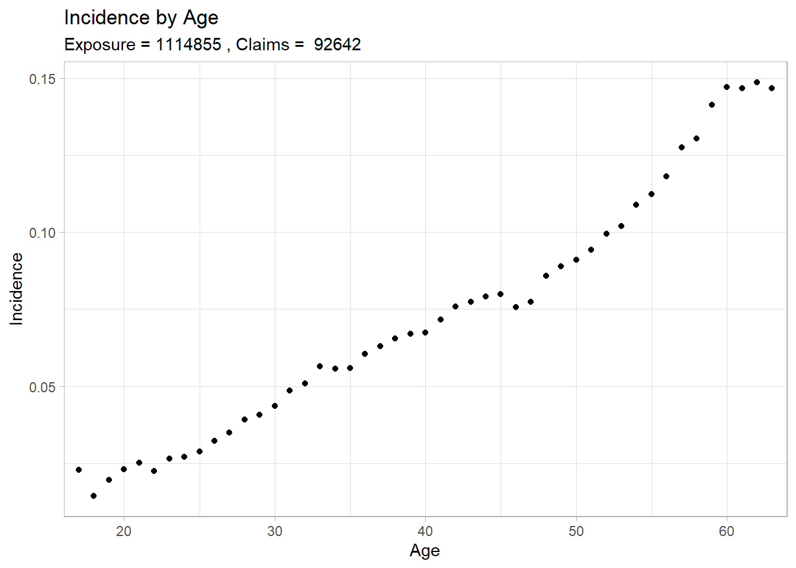 ### Nonstandard industry codes The nonstandard industry codes were not removed, as they appear to behave differently than the standard industry codes. The plots below show that there is a relatively high correlation between having a nonstandard industry code (96 to 99, corresponds to “invalid code”, “missing data”, “unmappable code”, “unknown code”).

This peculiarity may distort the model estimates and its predictive ability for datasets beyond the CDB.

<pre class="r"><code># Before deciding how to handle them, need to look for patterns
plot.i.s &lt;- plotIncidence(subset(data, industry %in% industry.levels[1:4]), age, claim,
                        title = &quot;Incidence by Age for Standard Industry Codes&quot;)
plot.i.ns &lt;- plotIncidence(subset(data, industry %in% industry.levels[5:8]), age, claim,
                        title = &quot;Incidence by Age for Nonstandard Industry Codes&quot;)
plot.i.i &lt;- plotIncidence(subset(data, data$industry == &quot;Invalid&quot;), age, claim,
                          title = &quot;Incidence by Age for Industry = 96\n(invalid code)&quot;)
plot.i.mi &lt;- plotIncidence(subset(data, data$industry == &quot;Missing&quot;), age, claim,
                           title = &quot;Incidence by Age for Industry = 97\n(missing code)&quot;)
plot.i.um &lt;- plotIncidence(subset(data, data$industry == &quot;Unmappable&quot;), age, claim,
                           title = &quot;Incidence by Age for Industry = 98\n(unmappable code)&quot;)
plot.i.uk &lt;- plotIncidence(subset(data, industry == &quot;Unknown&quot;), age, claim,
                           title = &quot;Incidence by Age for Industry = 99\n(unknown code)&quot;)
plot.i.bc &lt;- plotIncidence(subset(data, industry == &quot;BlueCollar&quot;), age, claim,
                           title = &quot;Incidence by Age for\nIndustry = Blue Collar&quot;)
plot.i.ts &lt;- plotIncidence(subset(data, industry == &quot;TradeAndServices&quot;), age, claim,
                           title = &quot;Incidence by Age for\nIndustry = Trade And Services&quot;)
plot.i.wc &lt;- plotIncidence(subset(data, industry == &quot;WhiteCollar&quot;), age, claim,
                           title = &quot;Incidence by Age for\nIndustry = White Collar&quot;)
plot.i.ps &lt;- plotIncidence(subset(data, industry == &quot;PublicServices&quot;), age, claim,
                           title = &quot;Incidence by Age for\nIndustry = PublicServices&quot;)

plot.i.s</code></pre>

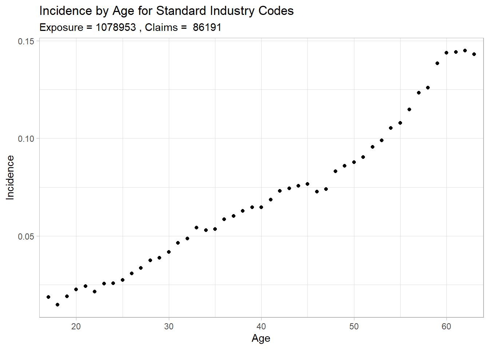

<pre class="r"><code>grid.arrange(plot.i.bc, plot.i.ts, plot.i.wc, plot.i.ps, nrow = 2)</code></pre>

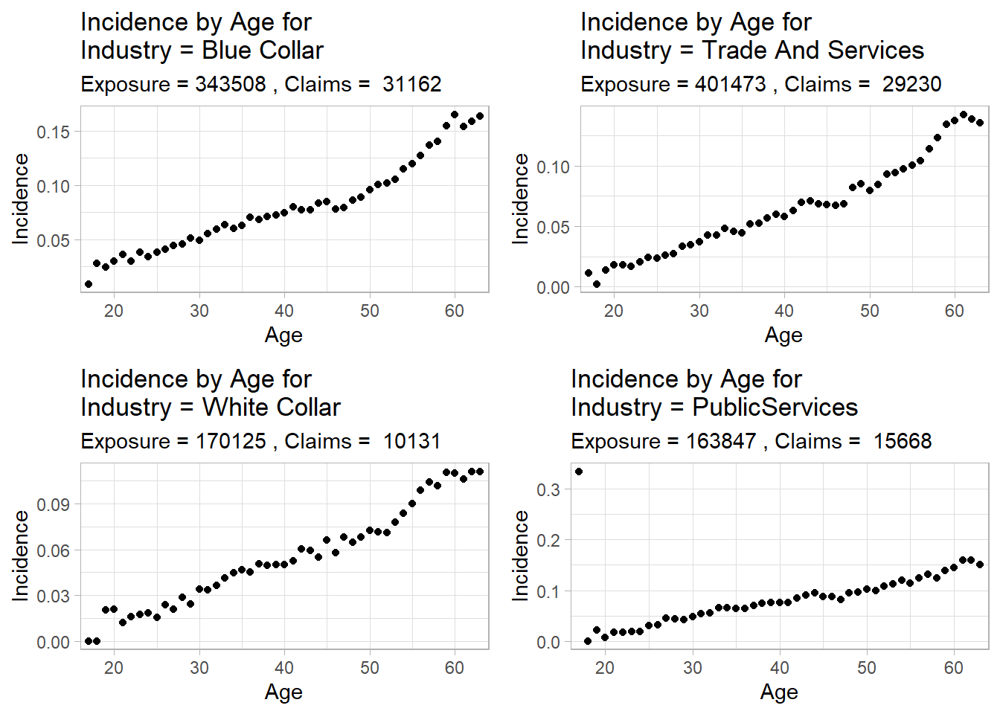

<pre class="r"><code># Plots show there is an higher correlation between these codes and incidence
plot.i.ns</code></pre>

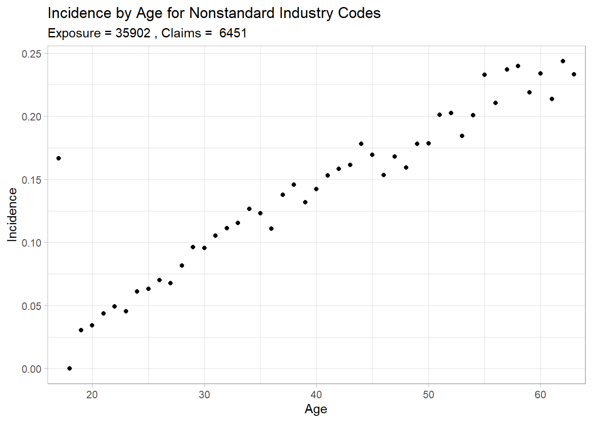

<pre class="r"><code>grid.arrange(plot.i.i, plot.i.mi, plot.i.um, plot.i.uk, nrow = 2)</code></pre>

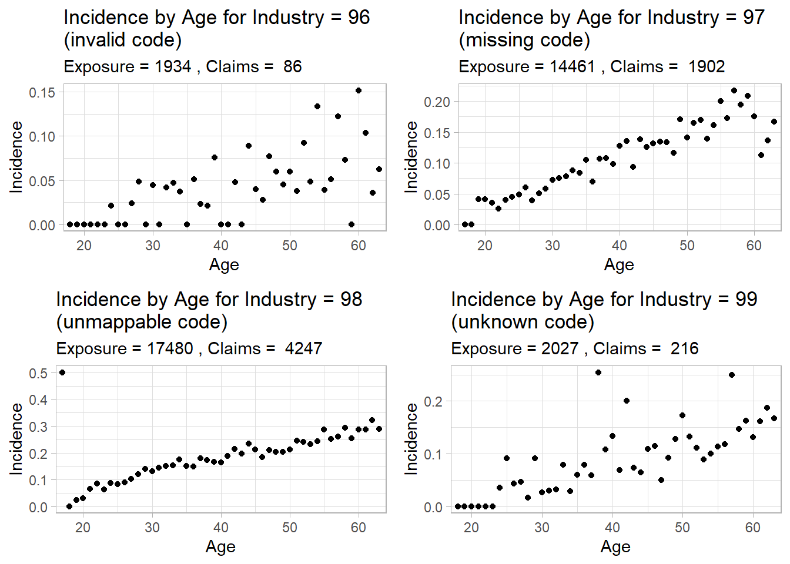

<h3>Gender</h3>

There are more female observations than male observations across all ages, however the shape of the distributions across age appear to be similar for the two groups.

<strong>Stacked Histogram</strong>

<pre class="r"><code>palette.g &lt;- c(&quot;#e66a5c&quot;, &quot;#36757d&quot;)
hist.g &lt;-
  ggplot(data, aes(x = age, color = gender, fill = gender)) +
  geom_histogram(binwidth = 1,
                 alpha = 0.75,
                 position = &quot;stack&quot;) +
  labs(
    title = &quot;Distribution of Age by Gender&quot;,
    x = &quot;Age&quot;,
    y = &quot;Count&quot;,
    subtitle = str_c(
      levels(data$gender)[1],
      &quot; Observations = &quot;,
      format(
        table(data$gender)[1],
        big.mark = &quot;,&quot;,
        scientific = FALSE
      ),
      &quot;, &quot;,
      levels(data$gender)[2],
      &quot; Observations = &quot;,
      format(
        table(data$gender)[2],
        big.mark = &quot;,&quot;,
        scientific = FALSE
      )
    )
  ) +
  theme_light() +
  theme(panel.grid.major = element_blank(),
        panel.grid.minor = element_blank()) +
  scale_color_manual(values = palette.g) +
  scale_fill_manual(values = palette.g) +
  scale_x_continuous(expand = c(0, 0)) +
  scale_y_continuous(expand = c(0, 0), limits = c(0, 40000))
hist.g</code></pre>

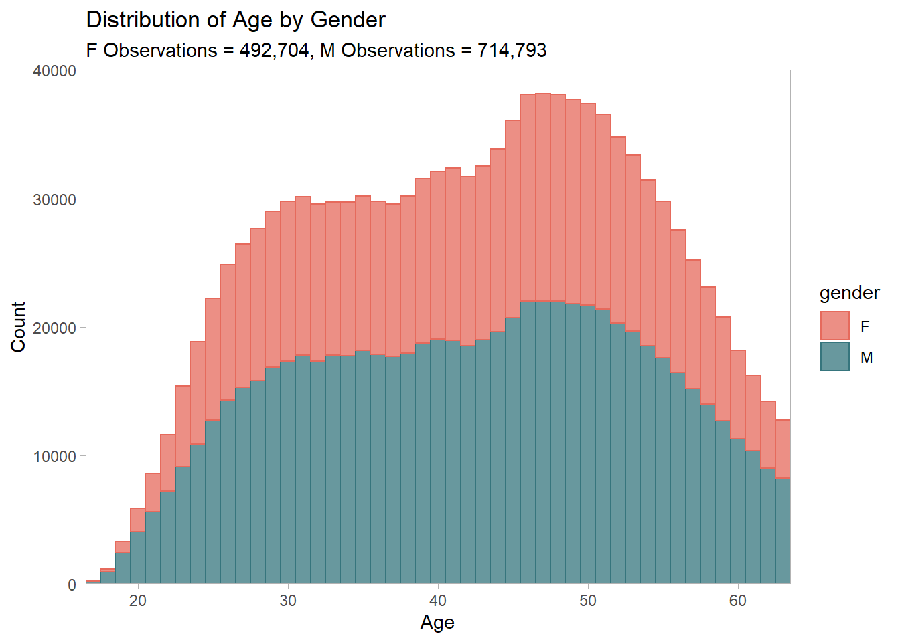

Looking at the incidence rates by age for both genders, there appears to be a change in the shape of the plot for males over age 45. For this reason, the regression models will have a spline at this age, active only for males.

<pre class="r"><code>plot.g &lt;- plotIncidence2(data, age, gender, claim,
                         palette = palette.g,
                         title = &quot;Incidence by Age and Gender&quot;)
plot.g</code></pre>

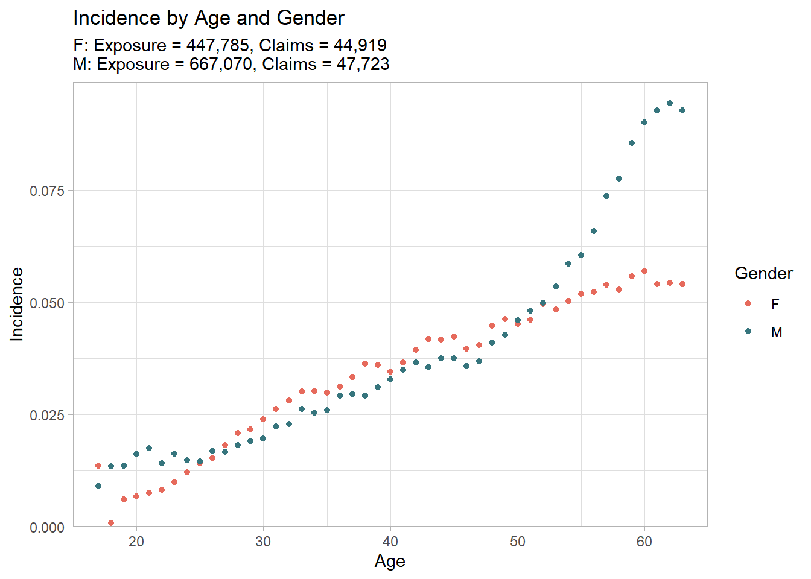 ### Region <strong>Stacked Histogram</strong>

<pre class="r"><code>palette.r &lt;- c(&quot;#E6B753&quot;, &quot;#5D7D39&quot;)
hist.r &lt;-
  ggplot(data, aes(x = age, color = region, fill = region)) +
  geom_histogram(binwidth = 1,
                 alpha = 0.75,
                 position = &quot;stack&quot;) +
  labs(
    title = &quot;Distribution of Age by Region&quot;,
    x = &quot;Age&quot;,
    y = &quot;Count&quot;,
    subtitle = str_c(
      levels(data$region)[1],
      &quot; Observations = &quot;,
      format(
        table(data$region)[1],
        big.mark = &quot;,&quot;,
        scientific = FALSE
      ),
      &quot;, &quot;,
      levels(data$region)[2],
      &quot; Observations = &quot;,
      format(
        table(data$region)[2],
        big.mark = &quot;,&quot;,
        scientific = FALSE
      )
    )
  ) +
  theme_light() +
  theme(panel.grid.major = element_blank(),
        panel.grid.minor = element_blank()) +
  scale_color_manual(values = palette.r) +
  scale_fill_manual(values = palette.r) +
  scale_x_continuous(expand = c(0, 0)) +
  scale_y_continuous(expand = c(0, 0), limits = c(0, 40000))
hist.r</code></pre>

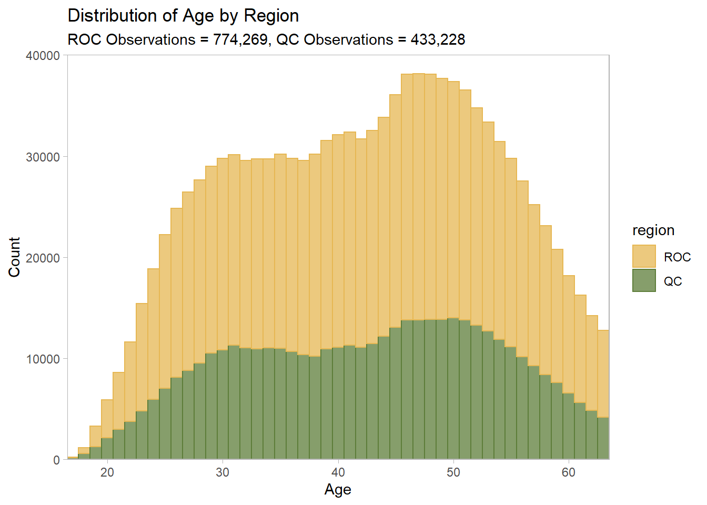 The distributions of ROC and QC observations appear similar in shape, while ROC overall has more observations.

Region plots are below.

<pre class="r"><code>plot.r &lt;-
  plotIncidence2(data,
                 age,
                 region,
                 claim,
                 palette = rev(palette.r),
                 title = &quot;Incidence by Age and Region&quot;)
plot.r</code></pre>

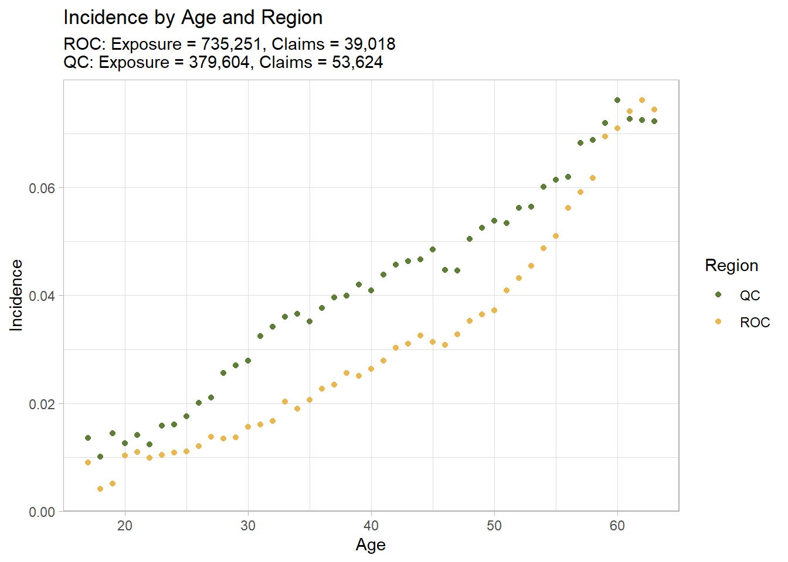 #### Region and Gender

<pre class="r"><code>plot.f.r &lt;- plotIncidence2(subset(data, data$gender == &quot;F&quot;),
                           age,
                           region,
                           claim,
                           palette = rev(palette.r),
                           title = &quot;Female Incidence by Age and Region&quot;)
plot.m.r &lt;- plotIncidence2(subset(data, data$gender == &quot;M&quot;), 
                           age, 
                           region, 
                           claim,
                           palette = rev(palette.r),
                           title = &quot;Male Incidence by Age and Region&quot;)
plot.f.r</code></pre>

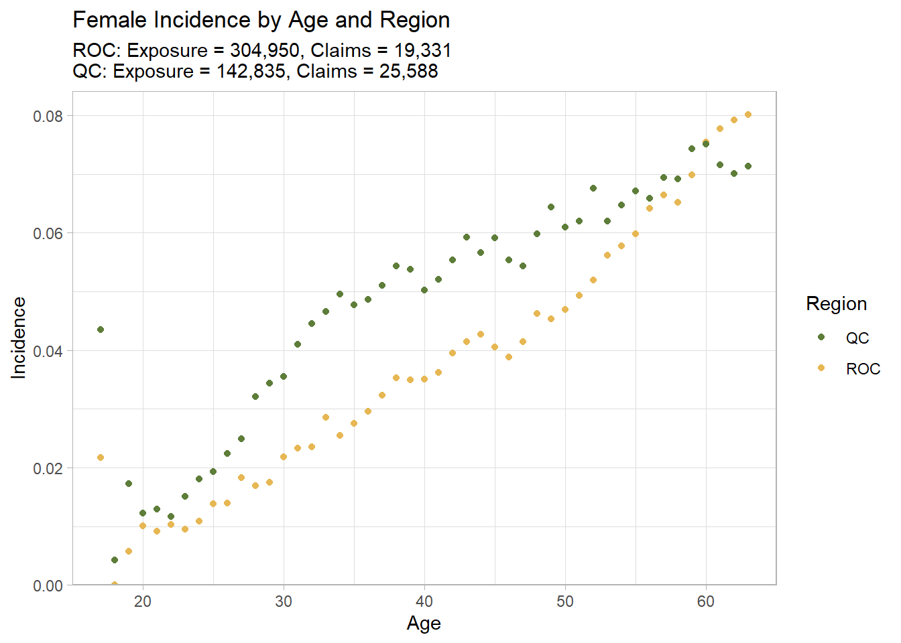

<pre class="r"><code>plot.m.r</code></pre>

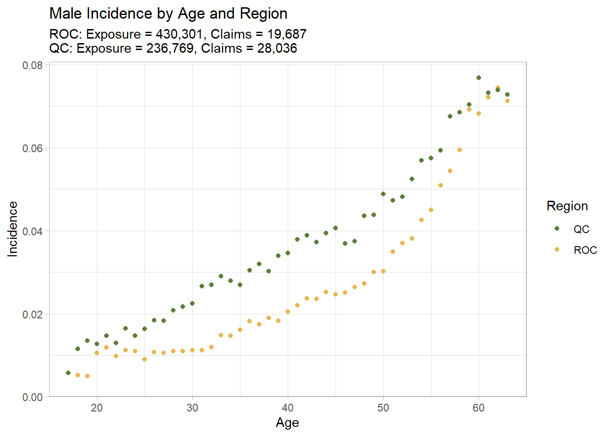 ### Benefit Amounts <strong>Stacked Histogram</strong>

<pre class="r"><code># Round benefit amounts to nearest 10 for plotting
hist.b &lt;-
  ggplot(data, aes(x = ben, color = gender, fill = gender)) +
  geom_histogram(binwidth = 100,
                 alpha = 0.75,
                 position = &quot;stack&quot;) +
  labs(
    title = &quot;Distribution of Benefit Amount by Gender&quot;,
    x = &quot;Benefit Amount&quot;,
    y = &quot;Count&quot;,
    subtitle = str_c(
      levels(data$gender)[1],
      &quot; Observations = &quot;,
      format(
        table(data$gender)[1],
        big.mark = &quot;,&quot;,
        scientific = FALSE
      ),
      &quot;, &quot;,
      levels(data$gender)[2],
      &quot; Observations = &quot;,
      format(
        table(data$gender)[2],
        big.mark = &quot;,&quot;,
        scientific = FALSE
      )
    )
  ) +
  theme_light() +
  theme(panel.grid.major = element_blank(),
        panel.grid.minor = element_blank()) +
  scale_color_manual(values = palette.g) +
  scale_fill_manual(values = palette.g) +
  scale_x_continuous(expand = c(0, 0)) +
  scale_y_continuous(expand = c(0, 0), limits = c(0, 40000))
hist.b</code></pre>

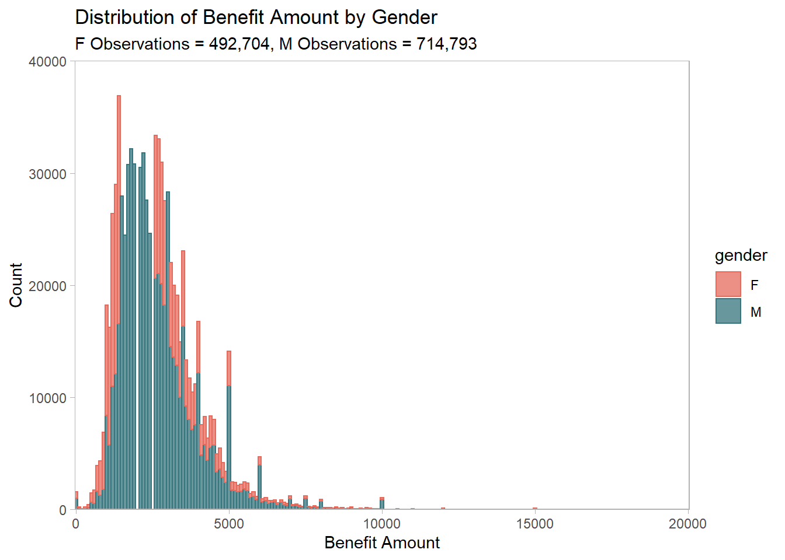

Benefit amounts show high variance under 1000 and after 5000.

<pre class="r"><code>plot.b &lt;- plotIncidence(mutate(data, ben = round(ben*2, -2)/2), 
                        ben, claim, title = &quot;Incidence by Benefit Amount&quot;) 
plot.b</code></pre>

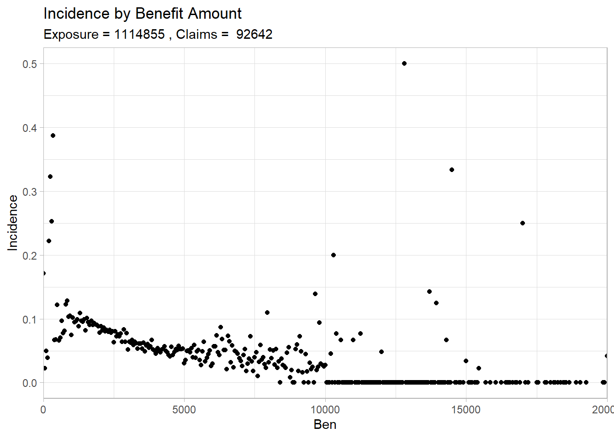 Looking more closely, incidence rates by benefit amount seem to spike downwards when the benefit amount is a “nice” number. This is illustrated in the tables below; note they have been rounded to the nearest 50 for compactness.

Smaller benefit amounts tended to spikes downwards at amounts divisible by 100.

<pre class="r"><code>freq.b &lt;- table(round(data$ben,-2)/2, data$claim)
freq.b.output &lt;- 
  tibble(Benefit = labels(freq.b)[[1]], 
                Exposure = freq.b[,1],
                Claims = freq.b[,2]) %&gt;% 
  mutate(Incidence = Claims/(Claims+Exposure))
kable(freq.b.output[27:37,], digits = c(0,0,0,4))</code></pre>
<table>
<thead>
<tr class="header">
<th align="left">Benefit</th>
<th align="right">Exposure</th>
<th align="right">Claims</th>
<th align="right">Incidence</th>
</tr>
</thead>
<tbody>
<tr class="odd">
<td align="left">1300</td>
<td align="right">31365</td>
<td align="right">2626</td>
<td align="right">0.0773</td>
</tr>
<tr class="even">
<td align="left">1350</td>
<td align="right">28830</td>
<td align="right">2283</td>
<td align="right">0.0734</td>
</tr>
<tr class="odd">
<td align="left">1400</td>
<td align="right">30659</td>
<td align="right">2263</td>
<td align="right">0.0687</td>
</tr>
<tr class="even">
<td align="left">1450</td>
<td align="right">25206</td>
<td align="right">1912</td>
<td align="right">0.0705</td>
</tr>
<tr class="odd">
<td align="left">1500</td>
<td align="right">38444</td>
<td align="right">2383</td>
<td align="right">0.0584</td>
</tr>
<tr class="even">
<td align="left">1550</td>
<td align="right">20245</td>
<td align="right">1358</td>
<td align="right">0.0629</td>
</tr>
<tr class="odd">
<td align="left">1600</td>
<td align="right">19174</td>
<td align="right">1216</td>
<td align="right">0.0596</td>
</tr>
<tr class="even">
<td align="left">1650</td>
<td align="right">17439</td>
<td align="right">1109</td>
<td align="right">0.0598</td>
</tr>
<tr class="odd">
<td align="left">1700</td>
<td align="right">14562</td>
<td align="right">919</td>
<td align="right">0.0594</td>
</tr>
<tr class="even">
<td align="left">1750</td>
<td align="right">21524</td>
<td align="right">1277</td>
<td align="right">0.0560</td>
</tr>
<tr class="odd">
<td align="left">1800</td>
<td align="right">12841</td>
<td align="right">729</td>
<td align="right">0.0537</td>
</tr>
</tbody>
</table>

For larger amounts, these spikes tended to occur at amounts divisible by 500.

<pre class="r"><code>kable(freq.b.output[60:85,], digits = c(0,0,0,4))</code></pre>
<table>
<thead>
<tr class="header">
<th align="left">Benefit</th>
<th align="right">Exposure</th>
<th align="right">Claims</th>
<th align="right">Incidence</th>
</tr>
</thead>
<tbody>
<tr class="odd">
<td align="left">2950</td>
<td align="right">1065</td>
<td align="right">49</td>
<td align="right">0.0440</td>
</tr>
<tr class="even">
<td align="left">3000</td>
<td align="right">4650</td>
<td align="right">144</td>
<td align="right">0.0300</td>
</tr>
<tr class="odd">
<td align="left">3050</td>
<td align="right">884</td>
<td align="right">60</td>
<td align="right">0.0636</td>
</tr>
<tr class="even">
<td align="left">3100</td>
<td align="right">1019</td>
<td align="right">56</td>
<td align="right">0.0521</td>
</tr>
<tr class="odd">
<td align="left">3150</td>
<td align="right">716</td>
<td align="right">54</td>
<td align="right">0.0701</td>
</tr>
<tr class="even">
<td align="left">3200</td>
<td align="right">796</td>
<td align="right">42</td>
<td align="right">0.0501</td>
</tr>
<tr class="odd">
<td align="left">3250</td>
<td align="right">824</td>
<td align="right">39</td>
<td align="right">0.0452</td>
</tr>
<tr class="even">
<td align="left">3300</td>
<td align="right">555</td>
<td align="right">28</td>
<td align="right">0.0480</td>
</tr>
<tr class="odd">
<td align="left">3350</td>
<td align="right">772</td>
<td align="right">41</td>
<td align="right">0.0504</td>
</tr>
<tr class="even">
<td align="left">3400</td>
<td align="right">659</td>
<td align="right">25</td>
<td align="right">0.0365</td>
</tr>
<tr class="odd">
<td align="left">3450</td>
<td align="right">507</td>
<td align="right">27</td>
<td align="right">0.0506</td>
</tr>
<tr class="even">
<td align="left">3500</td>
<td align="right">1192</td>
<td align="right">42</td>
<td align="right">0.0340</td>
</tr>
<tr class="odd">
<td align="left">3550</td>
<td align="right">405</td>
<td align="right">17</td>
<td align="right">0.0403</td>
</tr>
<tr class="even">
<td align="left">3600</td>
<td align="right">482</td>
<td align="right">13</td>
<td align="right">0.0263</td>
</tr>
<tr class="odd">
<td align="left">3650</td>
<td align="right">372</td>
<td align="right">19</td>
<td align="right">0.0486</td>
</tr>
<tr class="even">
<td align="left">3700</td>
<td align="right">306</td>
<td align="right">10</td>
<td align="right">0.0316</td>
</tr>
<tr class="odd">
<td align="left">3750</td>
<td align="right">1176</td>
<td align="right">49</td>
<td align="right">0.0400</td>
</tr>
<tr class="even">
<td align="left">3800</td>
<td align="right">291</td>
<td align="right">3</td>
<td align="right">0.0102</td>
</tr>
<tr class="odd">
<td align="left">3850</td>
<td align="right">211</td>
<td align="right">12</td>
<td align="right">0.0538</td>
</tr>
<tr class="even">
<td align="left">3900</td>
<td align="right">313</td>
<td align="right">13</td>
<td align="right">0.0399</td>
</tr>
<tr class="odd">
<td align="left">3950</td>
<td align="right">213</td>
<td align="right">7</td>
<td align="right">0.0318</td>
</tr>
<tr class="even">
<td align="left">4000</td>
<td align="right">882</td>
<td align="right">34</td>
<td align="right">0.0371</td>
</tr>
<tr class="odd">
<td align="left">4050</td>
<td align="right">182</td>
<td align="right">10</td>
<td align="right">0.0521</td>
</tr>
<tr class="even">
<td align="left">4100</td>
<td align="right">192</td>
<td align="right">6</td>
<td align="right">0.0303</td>
</tr>
<tr class="odd">
<td align="left">4150</td>
<td align="right">180</td>
<td align="right">7</td>
<td align="right">0.0374</td>
</tr>
<tr class="even">
<td align="left">4200</td>
<td align="right">104</td>
<td align="right">3</td>
<td align="right">0.0280</td>
</tr>
</tbody>
</table>

Reverse causality is a potential issue with this data. It might be that benefit amounts are more exact when being reported for a claim. This affects the validity of model estimates and predictive ability.

<h3>Correlation Plots</h3>

Correlation plots show overall low correlation between independent variables, with the exception of categorical variables, which is inherent to their design.

Note that ROC is the base region, F is the base gender, and BlueCollar is the base industry.

<pre class="r"><code>corr.data &lt;- data %&gt;% select(claim, age, gender, ben, region, industry)
corr.plot &lt;- model.matrix(~ 0 + ., data = corr.data)[c(-3), c(-3)] %&gt;%
  cor(use = &quot;pairwise.complete.obs&quot;) %&gt;%
  ggcorrplot(
    show.diag = F,
    type = &quot;upper&quot;,
    lab = TRUE,
    lab_size = 2,
    title = &quot;Variable correlations&quot;
  )
corr.plot</code></pre>

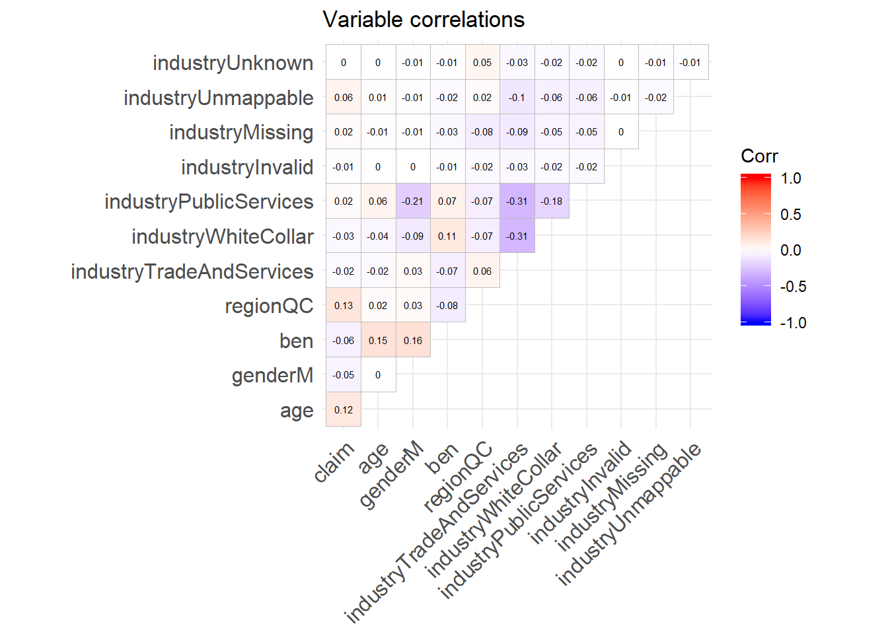 # Regression ### Set-up

<pre class="r"><code># clear all variables, keeping just data
rm(list=setdiff(ls(), &quot;data&quot;))
# Functions
simpleSpline &lt;- function(x, knot) {
  # Makes a simple spline dummy variable
  require(dplyr)
  spline &lt;- case_when(
    x &gt;= knot ~ x - knot,
    x &lt; knot ~ 0
  )
  return(spline)
}
AS &lt;- function(m, test, y) {
  # Calculates absolute score 
  require(magrittr)
  vcovHC &lt;- vcovHC(m, type = &quot;HC3&quot;)
  predict &lt;- predict(m, test, type = &quot;response&quot;, vcov = vcovHC)
  mean(abs(predict - y)) %&gt;%
    return()
}
BS &lt;- function(m, test, y) {
  require(magrittr)
  # Calculates Brier score 
  vcovHC &lt;- vcovHC(m, type = &quot;HC3&quot;)
  predict &lt;- predict(m, test, type = &quot;response&quot;, vcov = vcovHC)
  mean((predict - y) ^ 2) %&gt;%
    return()
}
AE &lt;- function(m, test, y, x1, x2, labels) {
  # Calculates AE table
  require(tidyverse)
  vcovHC &lt;- vcovHC(m, type = &quot;HC3&quot;)
  p &lt;- predict(m, test, type = &quot;response&quot;, vcov = vcovHC) 
  x1 &lt;- test[[deparse(substitute(x1))]]
  x2 &lt;- test[[deparse(substitute(x2))]]
  y &lt;- test[[deparse(substitute(y))]]
  d &lt;- tibble(x1 = x1, x2 = x2, y = y, p = p)
  ae &lt;- d %&gt;%
    group_by(x1, x2) %&gt;%
    summarise(AE = mean(y)/mean(p), .groups = &#39;drop&#39;) %&gt;%
    add_column(Group = labels, .before = &quot;AE&quot;)
  return(ae)
}
mle.aic &lt;- function(y, p, df){
  # Calculates AIC of the log likelihood
  # Used because glm computes AIC of a weird variant of log likelihood
  # By using the standard measurement of log likelihood, can apply 
  # to glmnet regressions that don&#39;t compute any AIC 
  ll &lt;- sum(y * -log(1 + exp(-p)) - (1 - y) * -log(1 + exp(p)))
  mle.aic &lt;- -2*ll + 2*df
  return(mle.aic)
}
mle.bic &lt;- function(y, p, df){
  # Calculates BIC of the log likelihood, for same reason as mle.aic
  ll &lt;- sum(y * -log(1 + exp(-p)) - (1 - y) * -log(1 + exp(p)))
  n &lt;- dim(as.matrix(y))[1]
  mle.bic &lt;- -2*ll + df*log(n)
}
df.rr &lt;- function(lambda,x) {
  # Calculates degrees of freedom using in AIC computation
  # glmnet does not do this correctly
  proj &lt;- x %*% solve(t(x) %*% x + lambda * diag(ncol(rrdata.x.train)))
  xt &lt;- t(x)
  df.rr &lt;- 0
  for (i in seq(dim(proj)[1])) {
    df.rr &lt;- df.rr + dot(proj[i,], xt[,i])
  }
  return(df.rr)
}

# Make dummies 
regdata &lt;- data %&gt;% select(age, region, gender, ben, industry)
dummies &lt;- dummyVars( ~ ., data = regdata, fullRank = T)
regdata &lt;- predict(dummies, newdata = regdata) %&gt;% as.data.frame()
regdata$claim &lt;- data$claim

spline46 &lt;- simpleSpline(regdata$age, 46)
regdata &lt;- regdata %&gt;% 
  mutate(
    age = poly(age, 1)[,1],
    age2 = poly(age, 2)[,2],
    age2spline = poly(age, 2)[,2]*spline46*gender.M
  )

# Partition
set.seed(0522)
trainIndex &lt;-
  createDataPartition(regdata$claim,
                      p = .67,
                      list = FALSE,
                      times = 1)
regdata.train &lt;- regdata[trainIndex[,1], ]
regdata.test  &lt;- regdata[-trainIndex[,1], ]

# Table containing models
m &lt;- tibble(
  model = list(),
  coef = list(),
  desc = character(),
  AIC = double(),
  BIC = double(),
  AS = double(),
  BS = double(),
  AE = list()
)</code></pre>

<h3>Evaluation Criteria</h3>

The evaluation criteria are AIC, BIC, AS, BS, AE.

AIC and BIC refer to the Akaike and Bayesian information criteria, which are measures of fit. Lower values indicate a better fit.

AS and BS refer to absolute and Brier score, which are measures of accuracy. They respectively measure mean absolute error and mean squared error between the predicted probability and the actual value of Y (0 or 1). Values closer to 0 indicate better predictive power.

Note that if we just blindly guessed the average incidence rate of 0.079 for each observation, then the BS would be \((1 - 0.079)(0.079 - 0)^2 + (0.079)(0.079 - 1)^2 = 0.0728\). So to do better than blind guessing, the BS should be under 0.0728. Likewise, the maximum AS we should see is \((1 - 0.079)|0.079 - 0| + (0.079)|0.079 - 1| = 0.1455\).

AE is the actual-to-expected ratio of incidence rates for a given data group. “Actual” is the probability in the test dataset, and “expected” is the probability predicted from the model.

The training and test data are split 67%/33% from the full dataset. Only one split was done for this initial investigation. Further analysis should aggregate results across multiple partitions.

Seven variations of logistic models were fitted to the data. The first five test various transformations of the benefit model. The 6th and 7th are ridge regression models, which aim to reduce bias by increasing variance. The degree of this adjustment is computed to minimize a criterion. Most frequently, it minimizes the cross-validated mean-squared error (CV) or the AIC. The former prioritizes prediction accuracy while the latter emphasizes fit.

It is important to note that since the data measures a rare event (&lt;10% rate), the coefficeints and predicted probabilities are subject to bias. Ridge regressions can mitigate this effect. Several other models are suitable for this situation, such as Firth’s penalized logistic regression and Firth’s penalized logistic regression with added covariates; however due to high computation costs they were not tested here.

The results for each model are summarized below.

<h3>Models</h3>

<h4>Base Model Formula</h4>

The base model, model 1, is based on the folllowing equation (not all industry dummies were included for compactness). It was based on observations from the data exploration, and in initial analysis showed to perform better than numerous different specifications of age.

\(\begin{align*}  claim &amp; = \beta_0 + \beta_1 age + \beta_2 age^2 + \beta_3 age^2 \times spline(age, 46) \times male + \beta_4 male \\ &amp; \quad + \beta_5 QC + \beta_6 benefit + \beta_7 WhiteCollar + \beta_8 PublicServices ...  \end{align*}\)

where \(spline(age, 46) = \begin{cases}  age - 46 &amp; \text{if } age \geq 46 \\  0 &amp; \text{if } age &lt; 46  \end{cases}\)

<h4>GLM: Models 1 to 6</h4>

These models fit using a standard maximum likelihood estimation, where probabilities are distributed according to a logit function. Variances and covariances are estimated using White’s heteroskedastic robust variances, as the data appears heteroskedastic (variance of errors is correlated with X).

<h1>Conclusion</h1>

In summary, there are peculiarities in the dataset that do not lend well to regression analysis; mainly, the tendency for nonstandard industry codes to yield high incidence rates, and the tendency for “nice” benefit amounts (like 1500 or 2000 versus an amount like 2718.4) to yield low incidence rates.

Overall AE values by region and gender were close to 1, particularly for the model with benefit removed. However when separated by age band, they start to diverge. It appears that this divergence is partially caused by region, as the ROC and QC tables seem to offset each other. If further predictions are made, it might be helpful to alter the model criteria to instead calculate AS and BS for each category (each age band for each region), and to test models with an interaction between splined age and region. It may also be helpful to remove benefit amounts from the model, which would also remove its data sampling issue.

It is important to note that this investigation was based on a simplified dataset that was only tested once split. This dataset had a much higher overall incidence rate than usual, so it is likely that in the full dataset, bias and predictive ability will worsen due to a lower rate (rule of thumb is to have at least 10%). Since the dataset was only tested on one training/test split, it is possible that the results are anomalous; future testing should aggregate results across multiple partitions.

<!-- tabsets -->

<!-- code folding -->

<!-- dynamically load mathjax for compatibility with self-contained -->


